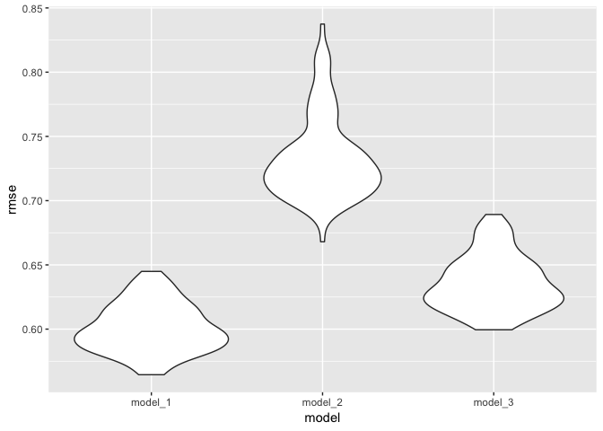

P8105\_hw6\_yx2510
================
Yi Xiao
20/11/2018

``` r
library(tidyverse)
library(stringr)
library(broom)
library(leaps)
library(modelr)
library(mgcv)
```

Problem one:
------------

##### 1. read and tidy the data:

``` r
homicide_data = read_csv("./data/homicide-data.csv") %>%
        janitor::clean_names() %>%
        unite(col = "city_state", city:state, sep = ", ", remove = FALSE) %>%
        mutate(solved = ifelse(disposition == "Closed by arrest", 1, 0),
               victim_race = ifelse(victim_race == "White", "white", "non_white"),
               victim_race = fct_relevel(victim_race, "white", "non_white"),
               victim_age = as.numeric(victim_age)) %>%
        filter(!(city_state %in% c("Dallas, TX", "Phoenix, AZ", "Kansas City, MO", "Tulsa, AL")))
```

    ## Warning in evalq(as.numeric(victim_age), <environment>): NAs introduced by
    ## coercion

##### 2. fit a logistic regression with resolved

``` r
baltimore_data = homicide_data %>%
        filter(city_state == "Baltimore, MD")
baltimore_model = baltimore_data %>% 
        glm(solved ~ victim_age + victim_sex + victim_race, data = ., family = binomial())

baltimore_model %>% 
  broom::tidy() %>%  # give log odds ratio
  mutate(OR = exp(estimate), # transform back
         lower_bound = exp(estimate - std.error*1.96),
         upper_bound = exp(estimate + std.error*1.96)) %>%
  filter(term == "victim_racenon_white") %>% 
  select(term, log_OR = estimate, OR, lower_bound, upper_bound, p.value) %>% 
  rename("odds_ratio" = OR, "log_odds_ratio" = log_OR) %>%
         knitr::kable(digits = 3)
```

| term                   |  log\_odds\_ratio|  odds\_ratio|  lower\_bound|  upper\_bound|  p.value|
|:-----------------------|-----------------:|------------:|-------------:|-------------:|--------:|
| victim\_racenon\_white |             -0.82|        0.441|         0.313|          0.62|        0|

Comment: the odds ratio estimate for victom\_race (non\_white) is 0.441 with 95% confidence interval being 0.313 to 0.62. This suggested that the odds of solving the non-white-related cases is 0.441 as that of the-white-invloved cases.

##### 3. Now run glm for each of the cities in your dataset, and extract the adjusted odds ratio (and CI) for solving homicides comparing non-white victims to white victims.

``` r
homicide_nest = homicide_data %>% 
  group_by(city_state) %>% 
  nest()

homicide_nest %>% 
  mutate(models = map(data, ~glm(solved ~ victim_age + victim_sex + victim_race, data = .x, family = binomial())),
    models = map(models, broom::tidy)) %>% 
  select(-data) %>% 
  unnest() %>% 
  filter(term == "victim_racenon_white") %>% 
  mutate(OR = exp(estimate),
         lower_bound = exp(estimate - std.error*1.96),
         upper_bound = exp(estimate + std.error*1.96)) %>%
  select(city_state, term, OR, lower_bound, upper_bound) %>%
  mutate(city_state = fct_reorder(city_state, OR)) %>% 
  ggplot(aes(x = city_state, y = OR)) + geom_point() + 
  geom_errorbar(mapping = aes(ymin = lower_bound, ymax = upper_bound)) +
  theme_bw() +
  theme(legend.position = "bottom",
        legend.direction = "horizontal",
        axis.text.x = element_text(angle = 90, size = 7)) +
 coord_flip() + 
  labs(y = "Odds ratio", 
       x = "City, State")
```


Problem two:
------------

##### 1. Load and clean the data for regression analys

``` r
birth_data = read_csv("./data/birthweight.csv") %>%
   janitor::clean_names()
```

    ## Parsed with column specification:
    ## cols(
    ##   .default = col_integer(),
    ##   gaweeks = col_double(),
    ##   ppbmi = col_double(),
    ##   smoken = col_double()
    ## )

    ## See spec(...) for full column specifications.

``` r
birth_tidy = birth_data %>%
    mutate(babysex = as.factor(babysex),
           frace = as.factor(frace),
           malform = as.factor(malform),
           mrace = as.factor(mrace),
            bwt = bwt*0.0022
           ) 
```

##### 2. regression model selection

We first plotted the distribution of birthweight

``` r
hist(birth_tidy$bwt)
```


We can see from the histgram that the birthweight data roughly follows normal distribution.

Then I selected best model for each size based on Cp and adjusted R-squared.

``` r
select_best = regsubsets(bwt ~ ., data = birth_tidy)
```

    ## Warning in leaps.setup(x, y, wt = wt, nbest = nbest, nvmax = nvmax,
    ## force.in = force.in, : 3 linear dependencies found

    ## Reordering variables and trying again:

``` r
fit_best = summary(select_best)
```

``` r
plot(2:10, fit_best$cp, xlab="Number of parameters", ylab="Cp Statistic")
abline(0,1) 
```


``` r
plot(2:10, fit_best$adjr2, xlab="Number of parameters", ylab="Adjusted R2")
```


I plotted the Cp value and adjusted r-squared for different number of parameters to see when Cp is closest to 1 (unbiased) and adjusted R2 is the largest. Cp value and R-2 did not get better noticeabaly after Number of parameters reached 8. However, I'd like to keep the demographic information (babysex) in the 9th medel, so I chose the model with 9 parameters.

Here is the model I chose.

``` r
model1 = lm(bwt ~ babysex + bhead + blength + delwt + frace + gaweeks + mrace + ppbmi + smoken, data = birth_tidy)
summary(model1)
```

    ## 
    ## Call:
    ## lm(formula = bwt ~ babysex + bhead + blength + delwt + frace + 
    ##     gaweeks + mrace + ppbmi + smoken, data = birth_tidy)
    ## 
    ## Residuals:
    ##     Min      1Q  Median      3Q     Max 
    ## -2.4404 -0.4018 -0.0104  0.3869  5.1282 
    ## 
    ## Coefficients:
    ##               Estimate Std. Error t value Pr(>|t|)    
    ## (Intercept) -1.245e+01  2.226e-01 -55.937  < 2e-16 ***
    ## babysex2     6.258e-02  1.861e-02   3.363 0.000778 ***
    ## bhead        2.891e-01  7.587e-03  38.100  < 2e-16 ***
    ## blength      1.645e-01  4.444e-03  37.006  < 2e-16 ***
    ## delwt        7.969e-03  6.264e-04  12.723  < 2e-16 ***
    ## frace2       1.910e-02  1.014e-01   0.188 0.850641    
    ## frace3       4.066e-02  1.525e-01   0.267 0.789709    
    ## frace4      -1.123e-01  9.826e-02  -1.143 0.253282    
    ## frace8      -5.121e-04  1.629e-01  -0.003 0.997491    
    ## gaweeks      2.540e-02  3.203e-03   7.930 2.77e-15 ***
    ## mrace2      -3.372e-01  1.013e-01  -3.330 0.000877 ***
    ## mrace3      -2.034e-01  1.580e-01  -1.287 0.198204    
    ## mrace4      -1.237e-01  9.911e-02  -1.248 0.212175    
    ## ppbmi       -2.765e-02  4.220e-03  -6.551 6.38e-11 ***
    ## smoken      -1.081e-02  1.291e-03  -8.368  < 2e-16 ***
    ## ---
    ## Signif. codes:  0 '***' 0.001 '**' 0.01 '*' 0.05 '.' 0.1 ' ' 1
    ## 
    ## Residual standard error: 0.6 on 4327 degrees of freedom
    ## Multiple R-squared:  0.7174, Adjusted R-squared:  0.7165 
    ## F-statistic: 784.5 on 14 and 4327 DF,  p-value: < 2.2e-16

##### 3. show a plot of model residuals against fitted values

``` r
birth_tidy %>% 
  add_residuals(model1) %>% 
  add_predictions(model1) %>% 
  ggplot(aes(x = pred, y = resid)) + geom_point() +
        geom_point(alpha = 0.2) +
    geom_smooth() +
    labs(
        y = "Residual Value",
        x = "Prediction Value"
    )
```

    ## `geom_smooth()` using method = 'gam' and formula 'y ~ s(x, bs = "cs")'


comment: The plot shows that the model poorly predicts very low and high birthweight

##### 4. compare models

``` r
cv_df =
    crossv_mc(birth_tidy, 100) %>% 
    mutate(
        train = map(train, as_tibble),
        test = map(test, as_tibble)
        ) %>% 
    mutate(
        model_1 = map(train, ~lm(bwt ~ babysex + bhead + blength + delwt + frace + gaweeks + mrace + ppbmi + smoken, data = .x)),
        model_2 = map(train, ~lm(bwt ~ blength + gaweeks, data = .x)),
        model_3 = map(train, ~lm(bwt ~ babysex + blength + bhead + babysex * blength + babysex * bhead + blength * bhead + babysex * blength * bhead, data = .x))
        ) %>% 
    mutate(
        rmse_model_1 = map2_dbl(model_1, test, ~rmse(model = .x, data = .y)),
        rmse_model_2 = map2_dbl(model_2, test, ~rmse(model = .x, data = .y)),
        rmse_model_3 = map2_dbl(model_3, test, ~rmse(model = .x, data = .y))
    )
cv_df %>% 
  select(starts_with("rmse")) %>% 
  gather(key = model, value = rmse) %>% 
  mutate(model = str_replace(model, "rmse_", ""),
         model = fct_inorder(model)) %>% 
  ggplot(aes(x = model, y = rmse)) + 
    geom_violin() +
    labs(
        x = "model",
        y = "rmse"
    )
```



`model_1`: `bwt ~ babysex + bhead + blength + delwt + frace + gaweeks + mrace + ppbmi + smoken` `model_2`: `bwt ~ blength + gaweeks` `model_3`: `bwt ~ babysex + blength + bhead + babysex * blength + babysex * bhead + blength * bhead + babysex * blength * bhead`

The above figure presents violin plots the RMSE for the three models. Based on these plots. My model is the best in terms of rmse.
